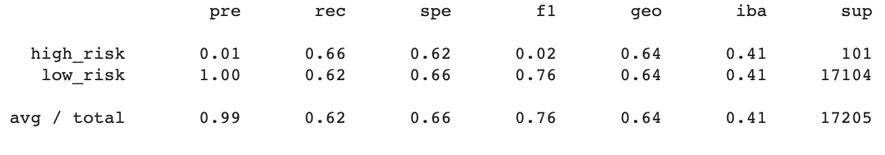
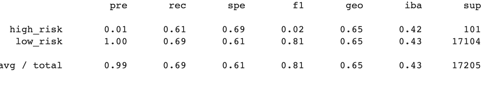
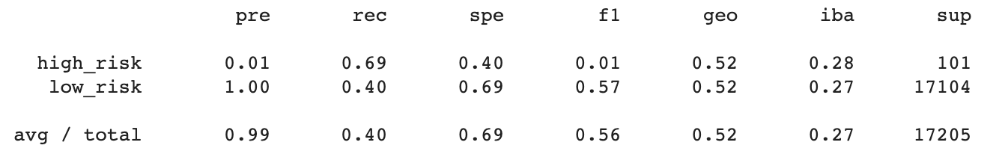
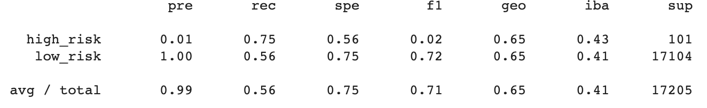
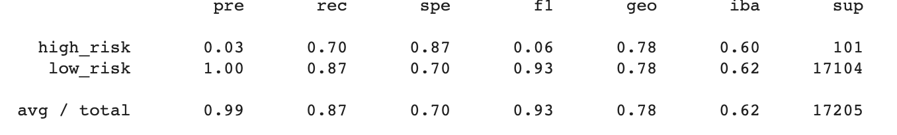
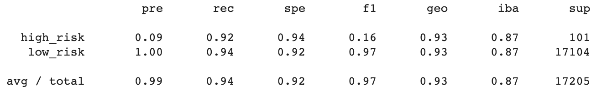

# Credit_Risk_Analysis

## Overview
### Supervised machine learning is utilized in this project to predict credit card risk. This is being done to provide a more efficient loan experience. Credit risk is an inherently unbalanced classification problem, as good loans easily outnumber risky loans. Therefore, different techniques were employed to train and evaluate models with unbalanced classes.

## Results

### Naive Random Oversampling

* Balanced Accuracy Score: 64%
* Precision High-Risk: 1%
* Precision Low-Risk: 100%
* Recall High-Risk: 66%
* Recall Low-Risk: 62%

### SMOTE Oversampling

* Balanced Accuracy Score: 65%
* Precision High-Risk: 1%
* Precision Low-Risk: 100%
* Recall High-Risk: 61%
* Recall Low-Risk: 69%

### Cluster Centroids Undersampling

* Balanced Accuracy Score: 54%
* Precision High-Risk: 1%
* Precision Low-Risk: 100%
* Recall High-Risk: 69%
* Recall Low-Risk: 40%

### SMOTEEN Combination (Over and Under) Sampling

* Balanced Accuracy Score: 66%
* Precision High-Risk: 1%
* Precision Low-Risk: 100%
* Recall High-Risk: 75%
* Recall Low-Risk: 56%

### Balanced Random Forest Classifier

* Balanced Accuracy Score: 79%
* Precision High-Risk: 3%
* Precision Low-Risk: 100%
* Recall High-Risk: 70%
* Recall Low-Risk: 87%

### Easy Ensemble ADABoost Classifier

* Balanced Accuracy Score: 93%
* Precision High-Risk: 9%
* Precision Low-Risk: 100%
* Recall High-Risk: 92%
* Recall Low-Risk: 94%

## Summary

### There were six supervised machine learning models used in this analysis. Accuracy, precision and recall scores were calculated and will be used to validate each classification model in order to determine which model is most effective. The Easy Ensamble ADABoost Classifier Model is being reccomended for use, as it has a high balanced accuracy, precision and recall scores. 
