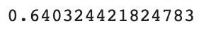

# Credit_Risk_Analysis

## Overview
### Supervised machine learning is utilized in this project to predict credit card risk. This is being done to provide a more efficient loan experience. Credit risk is an inherently unbalanced classification problem, as good loans easily outnumber risky loans. Therefore, different techniques were employed to train and evaluate models with unbalanced classes.

## Results
### Naive Random Oversampling

* Balanced Accuracy Score: 64%
